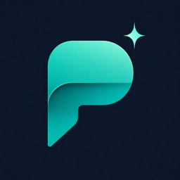
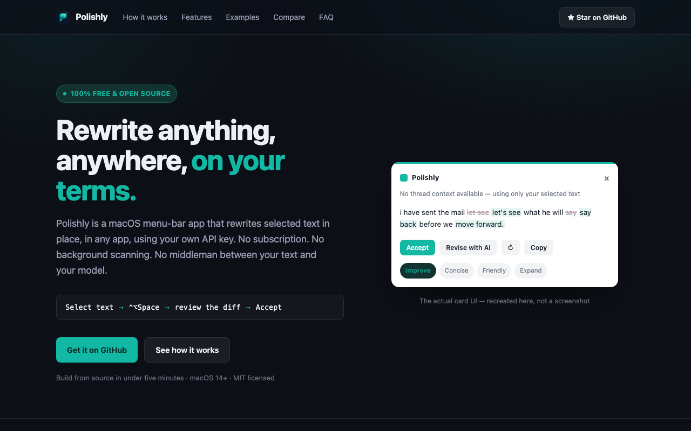

<p align="center">
  
</p>

# Polishly

<p align="center">
  <a href="LICENSE"></a>
  
  
</p>

**Select text anywhere on your Mac. Press one hotkey. Get a real, in-place rewrite.**

Polishly is a free, open-source macOS menu-bar app. No subscription. No background scanning. No middleman — you bring a free (or paid) API key, and your text goes straight from your Mac to the provider you chose.

```
Select text  →  ⌃⌥Space  →  review rewrite + inline diff  →  Accept
```

**[polishly.info](https://polishly.info)** — website, download, and full feature tour.

<p align="center">
  
</p>

<p align="center">
  <a href="https://raw.githubusercontent.com/kiranreddi/polishly/main/docs/video/polishly-promo.mp4">▶ Watch the full 52s demo with narration</a>
</p>

<p align="center">
  
</p>

## Truly free setup (recommended)

The app itself is **always free**. To use real AI rewrites at **$0**, pick a provider with a free tier and paste the key into Polishly.

| Provider | Card required? | Best for | Default model in Polishly |
|---|---|---|---|
| **[Groq](https://console.groq.com/keys)** | **No** | Everyday free rewrites | `llama-3.3-70b-versatile` |
| **[Cerebras](https://cloud.cerebras.ai/)** | Often yes (for free trial credits) | Very fast inference | `gpt-oss-120b` |
| On-device demo | No | Trying the UI offline | Local rules (no AI) |

**Recommendation:** start with **Groq** — signup is free, no credit card, and keys work in Polishly in under two minutes.

> Free tiers have rate limits (requests/tokens per day). Limits can change; check each provider’s console. Polishly never bills you — only the provider would, and only if *you* upgrade.

---

### 1) Get a free Groq API key (no credit card)

1. Open **[console.groq.com](https://console.groq.com)** and sign up (Google / GitHub / email).
2. Go to **[API Keys](https://console.groq.com/keys)** → **Create API Key**.
3. Name it something like `polishly`, create it, and **copy the key immediately** (it starts with `gsk_` and is shown once).
4. In Polishly:
   - Menu bar → **Settings** (or finish onboarding)
   - **Rewrite Provider** → **Groq**
   - Paste the key → leave model as `llama-3.3-70b-versatile` (or pick another Groq model id)
   - **Save & Remember Key**
5. Optional: click **Test Connection**, then try a rewrite in Notes with **⌃⌥Space**.

That’s it — Polishly + Groq free tier = real AI rewrites with no Polishly fee and no Groq card on file.

---

### 2) Get a Cerebras API key (free trial credits)

1. Open **[cloud.cerebras.ai](https://cloud.cerebras.ai/)** (Cerebras Inference Cloud Console) and create an account.
2. Create an API key under **API Keys** (keys often look like `csk-…`). Copy it.
3. Cerebras’s free trial typically grants starter credits after account setup; **some accounts require adding a verified payment method before API access activates**, even if you are not charged until you buy more credits. Check **Billing / Limits** in their console for your account.
4. In Polishly:
   - **Rewrite Provider** → **Cerebras**
   - Paste the key → model `gpt-oss-120b` (default)
   - **Save & Remember Key** → **Test Connection**

Use Cerebras when you want faster inference; use Groq when you want the simplest no-card free path.

---

### Paste the key into Polishly

1. Open Polishly from the menu bar.
2. **Settings → Rewrite Provider**.
3. Choose **Groq** or **Cerebras**.
4. Paste the API key into the key field.
5. Click **Save & Remember Key** (stored in the macOS Keychain — never in plaintext prefs).
6. Select text in Notes → press **⌃⌥Space** → Accept.

Paid providers still work the same way if you prefer them later: [OpenAI](https://platform.openai.com/api-keys) · [Anthropic](https://console.anthropic.com/).

---

## Why Polishly

- **$0 for the app, forever.** MIT-licensed; no subscription, no markup.
- **Bring your own key.** OpenAI, Anthropic, Groq, or Cerebras — or stay on local demo mode with zero network.
- **Explicitly invoked.** Nothing is read or sent until you press the hotkey.
- **Real word-level diff.** See exactly what changed before you Accept.
- **System-wide.** Notes, Mail, Slack, Teams, browsers — anywhere Accessibility can read a selection.

## Install

### Release build (recommended)

```sh
brew install xcodegen   # once
git clone git@github.com:kiranreddi/polishly.git
cd polishly
./scripts/package-release.sh
```

That produces:

- `dist/Polishly.app` — signed Release build (hardened runtime)
- `dist/Polishly-1.0.0.dmg` — distributable disk image

Install:

```sh
osascript -e 'tell application "Polishly" to quit' 2>/dev/null || true
rm -rf /Applications/Polishly.app
cp -R dist/Polishly.app /Applications/
xattr -cr /Applications/Polishly.app
open /Applications/Polishly.app
```

Keeping the same **Team ID** (`W26KHF87HS`) and bundle id (`com.polishly.Polishly`) across rebuilds preserves Accessibility approval — you usually should not need to re-grant it after updating.

### Debug build (development)

```sh
xcodegen generate
xcodebuild -project Polishly.xcodeproj -scheme Polishly -configuration Debug build
open "$(ls -d ~/Library/Developer/Xcode/DerivedData/Polishly-*/Build/Products/Debug/Polishly.app | head -1)"
```

### First-run setup

1. Open Polishly from `/Applications` (menu-bar app — no Dock icon).
2. Grant **Accessibility** when prompted (*System Settings → Privacy & Security → Accessibility*).
3. Finish onboarding: stay on demo, or connect **Groq / Cerebras / OpenAI / Anthropic**.
4. Optional: Settings → **Open at Login**.

### Uninstall

1. Settings → turn off **Open at Login** (or remove Polishly under *System Settings → General → Login Items*).
2. Quit Polishly from the menu bar.
3. Delete `/Applications/Polishly.app`.
4. API keys stay in Keychain until you remove `com.polishly.apiKey.*` in Keychain Access.

## Using it

1. Select text in any app.
2. Press **⌃⌥Space** (configurable in Settings).
3. Pick a tone — **Improve · Concise · Friendly · Expand** — or **Revise with AI** with a free-form instruction.
4. Review the inline diff → **Accept** (replace in place) or **Copy**.

### Real examples

These are genuine outputs from Polishly’s “Revise with AI” path during testing — not cherry-picked marketing copy.

**Instruction: "translate this to Spanish"**  
> Input: *I think we should push the meeting to next week.*  
> Output: *Creo que deberíamos posponer la reunión para la próxima semana.*

**Instruction: "make this concise — cut it to two sentences"**  
> Input: *Our Q3 numbers came in below target, mostly because of the delayed product launch…*  
> Output: *Our Q3 results missed targets due to a delayed product launch caused by last-minute engineering bugs, with marketing budget partially sunk. We're revising the Q4 forecast accordingly and will meet this week to discuss next steps.*

**Instruction: "rewrite this as a bulleted list"**  
> Input: *The new onboarding flow requires users to verify their email, set up two-factor authentication…*  
> Output:
> - Users must verify their email  
> - Users must set up two-factor authentication  
> - Users must complete a short profile  
> - Access to the dashboard is granted after these steps  
> - Approximately 40% of users drop off during the 2FA step  

## How it's built

- Swift + SwiftUI, AppKit `NSPanel` for the floating card (non-activating, so focus stays in the app you’re rewriting).
- macOS Accessibility API for selection + in-place replace, with a clipboard-transaction fallback for Electron apps (Teams, Slack).
- Local word-level diff — the model returns clean text; Polishly computes the diff.
- Streaming completions from your configured provider.

## Testing

```sh
xcodegen generate
xcodebuild -project Polishly.xcodeproj -scheme Polishly -configuration Debug test
```

## Privacy

Polishly only sends text when you explicitly invoke the hotkey. Your selection goes from your Mac to the provider you configured, using your key. Polishly has no rewrite backend and never sees your text. Sensitive apps (password managers, etc.) are blocked.

## Contributing

[Issues](https://github.com/kiranreddi/polishly/issues) and PRs welcome. Small personal open-source project — be reasonable.

## License

[MIT](LICENSE)
